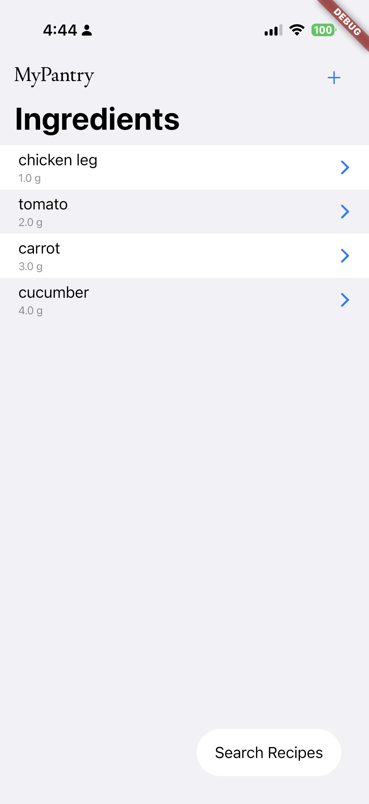
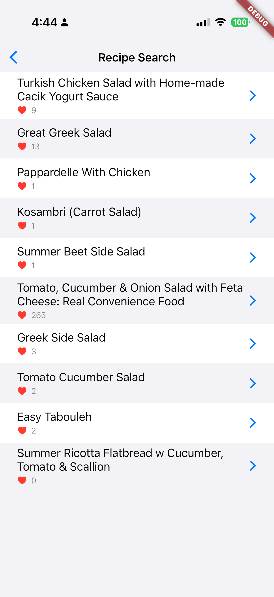

# MPX: Recipe Finder

<p align="center">
  
  
</p>

MyPantry is a Flutter-based recipe discovery app with an ingredient-level focus. Users can use what is already available in their fridge and pantry to discover relevant recipes with the Spoonacular API.

## Architecture

This app relies on a Model-View-ViewModel (MVVM) architecture. Here is a breakdown:

**Architecture: MVVM (Model-View-ViewModel)**

- **Models** (Data structures)
- **Views** (UI components)
- **ViewModels** (Business logic & state management)
- **Services** (API interactions)
- **Repository** (Data source abstraction)
- **Storage** (Local persistence)

## Core Featureset

Here are the currently supported features:

- **Ingredient Management**
  - Ability to add ingredients through searching by text (with included autocomplete)
  - Scan UPC product barcodes to grab ingredients
  - Allow users to specify ingredient amounts with adjustable units
  - Storage of ingredients in SharedPreferences
- **Recipe Discovery**
  - Once ingredients are inputted, users can discover recipes based on their current list of pantry items
  - This view allows sorting by matching ingredients
  - Allows users to view missing ingredients and ingredient match percentage to know how much they need to buy
- **Dark Mode Support**

## Data Models

- **Ingredient** (`lib/models/ingredient.dart`)
  - Represents food items with ID, name, image, amount, unit
  - Used in both product scanning and recipe matching
- **Recipe** (`lib/models/recipe.dart`)
  - Contains recipe metadata (title, image, likes)
  - Tracks usedIngredients vs missedIngredients
  - Used for matching user's ingredients to available recipes
- **Product** (`lib/models/product.dart`)
  - Represents scanned UPC products
  - Contains brand info, price, servings, ingredient list
  - Links physical products to ingredient data

## User Flow

1. **Home Screen** (IngredientView)
   - Display the user's current pantry in a home view
   - Click the "+" button in the top right to add ingredients
2. **Adding Ingredients**
   - 2 Options...
   - A: Search → IngredientSearchView → AmountView
   - B: Scan UPC → UPCScannerWidget → Extract ingredients
3. **Finding Recipes**
   - On the home screen, press "Search Recipes" to enter the RecipeView
   - Available recipes will be fetched, sorting by ingredient match similarity
     Tap recipe to show details (RecipeDetailView)

## Key Dependencies

The project relies on the following key dependencies:

- **cupertino_icons**: Provides iOS-style icons for user interfaces.
- **http**: Enables making HTTP requests for API interactions (e.g., to connect with Spoonacular).
- **mobile_scanner**: Allows barcode/QR code scanning—used for scanning UPCs on food products.
- **flutter_dotenv**: Facilitates loading environment variables securely from a `.env` file (e.g., for API keys).
- **provider**: Implements simple and scalable state management throughout the app.
- **liquid_glass_renderer**: Adds advanced glassmorphic UI (blur and frosted effects) for a modern look and feel.
- **flutter_svg**: Allows SVG asset rendering, for high-quality vector graphics and icons.
- **shared_preferences**: Persists lightweight information (like user ingredient lists and settings) locally on the device.

**For Development and Testing:**

- **flutter_test**: Flutter's official package for unit and widget testing.
- **mockito**: Used for creating mock classes and writing test doubles.
- **build_runner**: Automates code generation tasks, including mocks.
- **integration_test**: Supports running integration tests on real or emulated devices.
- **flutter_launcher_icons**: Easily generates app icons for different platforms.
- **flutter_lints**: Adds recommended lint rules for code quality and consistency.

See `pubspec.yaml` for the full dependency specification and version numbers.

## Running Locally

To set this app up...

1. Clone the repository
2. Create a `.env` file with a self-provided Spoonacular API key
   - Can be obtained from creating a free account at https://spoonacular.com/
3. Run `flutter pub get` to install dependencies
4. Plug in a compatible iOS device and run `flutter run` to deploy to said device

## Testing

To run all tests, run the comprehensive test suite shell script with:

```bash
./run_tests.sh
```

Alternatively you can run the command `flutter test` for Unit and Widget tests, and/or `flutter test integration_test/` to run Integration tests.

### Mocking

The test suite uses Mockito for mocking dependencies. Mock classes are generated using `build_runner`.

To regenerate mocks after adding `@GenerateMocks` annotations:

```bash
flutter pub run build_runner build --delete-conflicting-outputs
```
